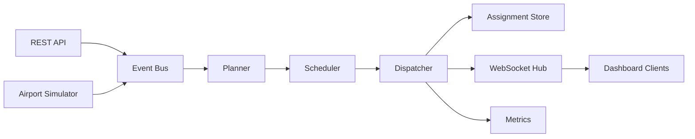
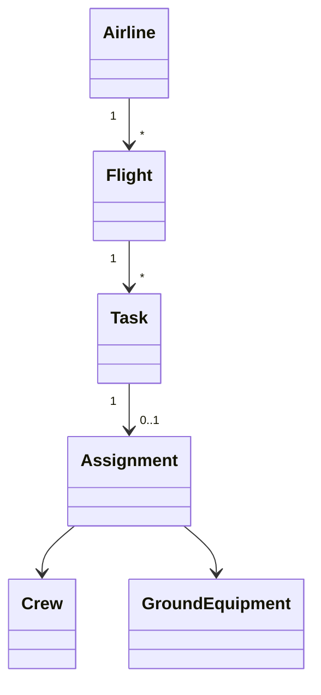
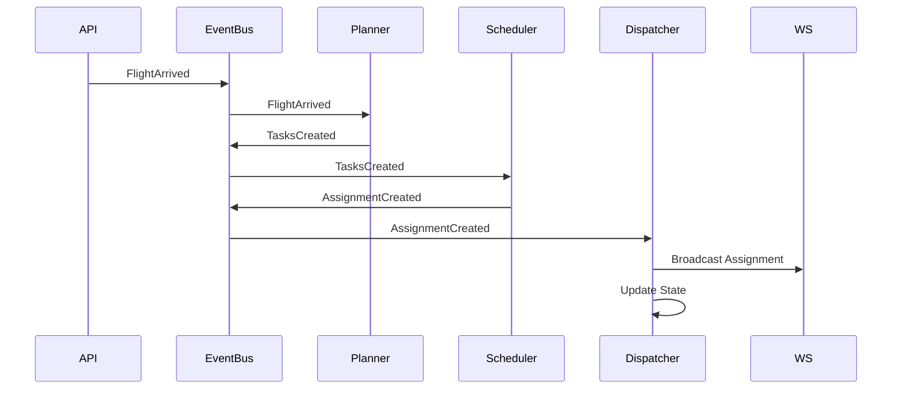

# ARCHITECTURE.md

# Ground Control - Architecture

## Overview

Ground Control is a simplified, HALO-inspired backend that coordinates aircraft turnaround operations.

The system reacts to operational events (flight arrivals, delays, crew availability, equipment failures), plans required work, schedules the best available resources, dispatches assignments, and publishes real-time updates.

The design emphasizes:
- Event-driven architecture
- Concurrency using goroutines and channels
- Clear separation of responsibilities
- Idiomatic Go

---

# High-Level Architecture



---

# Component Responsibilities

## API

Receives commands from clients.

Examples:

- Create Flight
- Register Crew
- Register Equipment
- Publish Operational Event

The API performs minimal business logic. It validates requests and publishes events.

---

## Event Bus

The central communication mechanism.

All major state changes are represented as events.

Example events:

- FlightArrived
- FlightDelayed
- EquipmentBroken
- CrewAvailable
- TaskCompleted

Implementation:

- Go channels
- Publisher/Subscriber pattern
- Multiple consumers

---

## Planner

Responsibility:

Determine **what work needs to happen**.

Example:

Flight arrives

↓

Planner creates:

- Fuel Task
- Cleaning Task
- Catering Task
- Baggage Task
- Pushback Task

Planner does **not** decide who performs the work.

---

## Scheduler

Responsibility:

Determine **who should perform the work**.

Simple scoring factors:

- Equipment compatibility
- Crew availability
- Distance
- Flight priority
- Departure deadline

Produces Assignment objects.

---

## Dispatcher

Responsibility:

Execute assignments.

Updates:

- Crew state
- Equipment state
- Task state

Publishes:

- AssignmentCreated
- AssignmentCompleted

Broadcasts updates to WebSocket clients.

---

## Metrics

Tracks operational KPIs:

- Active Flights
- Pending Tasks
- Busy Crews
- Completed Tasks
- Average Dispatch Time

---

# Domain Model



## Entities

### Airline

Represents an airline operating flights.

Examples:

- Delta
- United
- Southwest

---

### Flight

Represents an aircraft turnaround.

Fields:

- Flight Number
- Airline
- Gate
- Status
- Scheduled Departure

---

### Task

Unit of work.

Examples:

- Fuel
- Cleaning
- Catering
- Pushback
- Baggage

Lifecycle:

Pending

↓

Assigned

↓

In Progress

↓

Completed

---

### Crew

Ground personnel.

Attributes:

- Role
- Status
- Current Location

---

### GroundEquipment

Examples:

- Fuel Truck
- Pushback Tug
- Belt Loader
- Catering Truck

Status:

Available

Busy

Broken

---

### Assignment

Connects:

Task

↓

Crew

↓

Equipment

Contains:

- ETA
- Status
- Created Time

---

# Event Flow



---

# Package Layout

```
cmd/
    server/

internal/

    api/
    domain/
    store/
    events/
    planner/
    scheduler/
    dispatcher/
    ws/
    metrics/
```

---

# Concurrency Model

Each major component runs independently.

```text
REST API
        │
        ▼

Event Channel

 ┌──────────────┬─────────────┬──────────────┐
 │              │             │
Planner     Scheduler    Dispatcher
 │              │             │
 └──────────────┴─────────────┘

WebSocket Hub

Metrics
```

Go primitives:

- goroutines
- channels
- sync.RWMutex
- context.Context

---

# Design Decisions

## Event-Driven

Instead of direct service-to-service calls, components communicate through events.

Benefits:

- Loose coupling
- Easier testing
- Extensible workflow
- Natural concurrency

---

## Planner vs Scheduler

Planner answers:

"What work is required?"

Scheduler answers:

"Who should perform it?"

Separating these responsibilities keeps business rules independent from optimization logic.

---

## In-Memory Storage

Chosen intentionally.

Benefits:

- Simple
- Fast
- Focus remains on Go and architecture

Persistence is outside the scope of this project.

---

# Future Enhancements

Possible extensions:

- PostgreSQL persistence
- MQTT integration
- GPS-based distance calculation
- Real routing algorithms
- gRPC services
- Kafka event bus
- Distributed scheduler
- Multi-airport support
- AI-assisted scheduling
- Autonomous equipment simulation

These are intentionally deferred to keep the project focused on Go fundamentals and event-driven system design.
